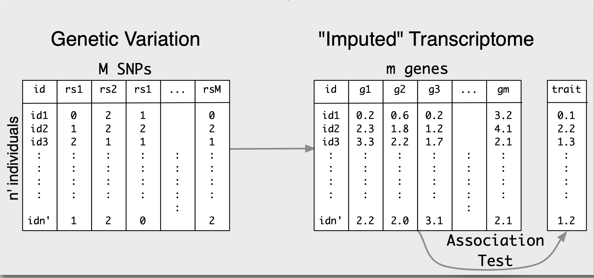

# RatXcan Training

## Summary of Analysis
* Predict gene expression for Ac tissue using PrediXcan
* Predict height, bmi using predicted expression and PTRS weights
* [Compute correlations between predicted and observed traits for each PTRS model](analysis/Plot_Correlations.Rmd)

## Setup 
* Git clone [MetaXcan](https://github.com/hakyimlab/MetaXcan)
* Create [conda environment](https://github.com/hakyimlab/MetaXcan/blob/master/README.md#example-conda-environment-setup) 
* Mount Box drive: [https://support.box.com/hc/en-us/articles/360043697474-Installing-and-Updating-Box-Drive](https://support.box.com/hc/en-us/articles/360043697474-Installing-and-Updating-Box-Drive)

## PrediXcan

Individual level PrediXcan takes a genotype file and prediction model to compute predicted gene expression. For our analysis, we use prediction models trained with elasticnet methods on rat genotype and transcriptome data. The models are in Box:`imlab-data/data-Github/Rat_Genomics_Paper_Pipeline/Results/sql`. We use processed genotypes in text format:`imlab-data/data-Github/Rat_Genomics_Paper_Pipeline/data/rat_genotypes_LD_pruned_0.95`.

## PTRS

Usually, the next step in the PrediXcan method is computing associations between predicted gene expression and the phenotype, however today we stop after running `Predict.py`. Instead, we use PTRS weights to predict phenotype from gene expression. 

We use PTRS models trained on PGP genotype and phenotype data. Although the PGP database is human data, many human genes are expressed in rats, and we posit they have similar effects on phenotypic traits.

## Correlation Test

Lastly, we compare predicted and observed trait data. PTRS contains risk scores under a number of different models, each defined by a different number of genes. The result is a different predicted trait value for under each model. For each model, we run a correlation test between predicted and observed trait values, and summarize them in a plot.
